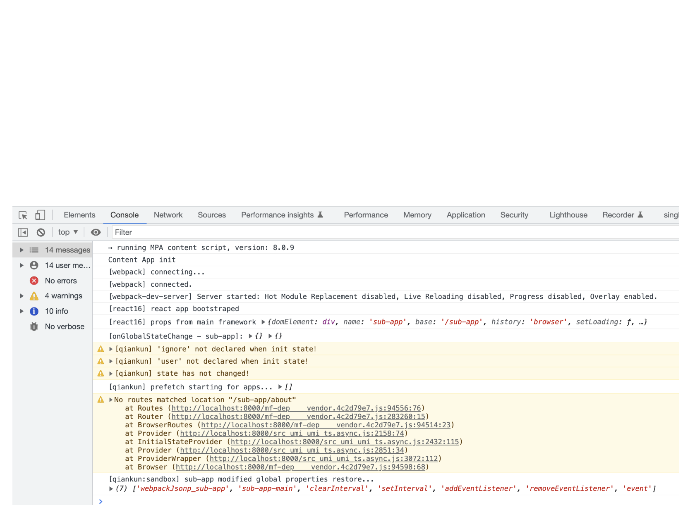

# README

demo for issue: https://github.com/umijs/umi/issues/8965

## 问题

```js
import { defineConfig } from '@umijs/max';

export default defineConfig({
  antd: {},
  access: {},
  model: {},
  initialState: {},
  request: {},
  layout: {
    title: '@umijs/max',
  },
  routes: [
    {
      name: 'SubApp',
      path: '/sub-app',
      microApp: 'sub-app',
      //  需手动配置通配路由
      // routes: [
      //   {
      //     path: '/sub-app/*',
      //   },
      // ],
    },
    {
      name: '首页',
      path: '/home',
      component: './Home',
    },
  ],
  npmClient: 'yarn',
  qiankun: {
    master: {
      apps: [
        {
          name: 'sub-app',
          entry: '//localhost:7100/sub-app',
        },
      ],
    },
  },
});
```



